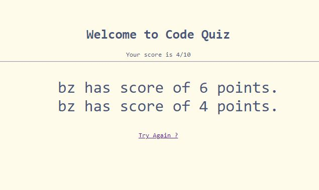

credit for example questions 
https://www.guru99.com/javascript-interview-questions-answers.html

# 04-Code-Quiz

## Description 

This is a timed quiz application is for student of a boot camp like my self to practice on interview process for developers. 

As a coding boot camp student, I should be able to take a timed quiz on JavaScript fundamentals that stores scores, so that I can gauge my progression on coding.

Question in this quiz as of now has only 10, but it could easily be increased to a lot more by putting more questions into the question bank. 

Github Repo: https://github.com/byxzESC/04-Code-Quiz

Deployed Page: https://byxzesc.github.io/04-Code-Quiz/

## Installation

No installation needed.

## Usage 

Step 1. click on Start Button

Step 2. click on your answer selection

Step 3. enter your initial and press enter after you are done with the quiz

Other Feature, click on top left view high score button to see the score board.

## Credits

credit for example questions 
https://www.guru99.com/javascript-interview-questions-answers.html

Guide to shuffle questions array using math random function minus 0.5
https://stackoverflow.com/questions/69242025/javascript-array-shuffling-why-does-the-random-number-have-to-be-shifted-0-5-d

## License

N/A

---

🏆 The sections listed above are the minimum for a good README, but your project will ultimately determine the content of this document. You might also want to consider adding the following sections.

## Badges

## Features

N/A

## Tests

N/A
No written test yet.
